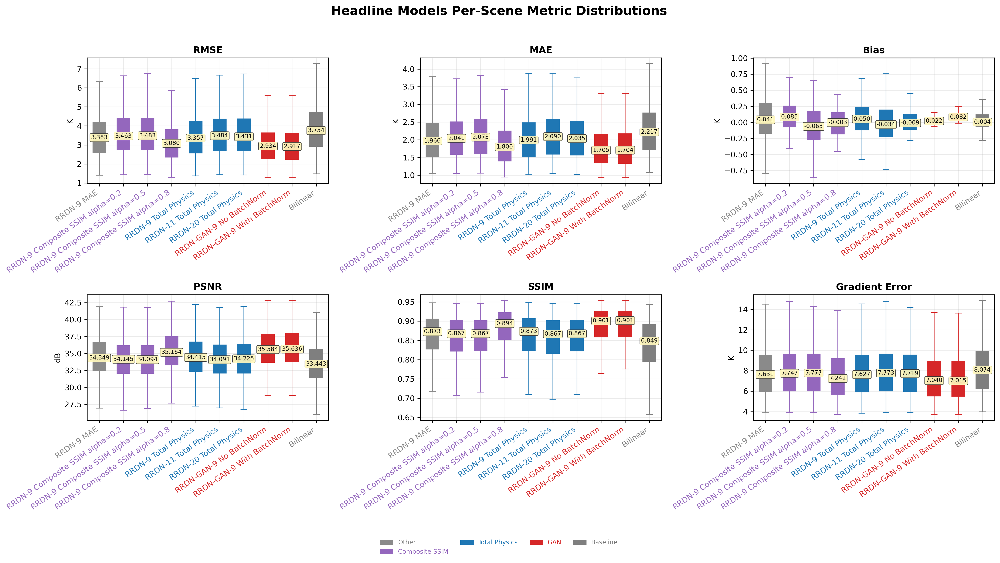
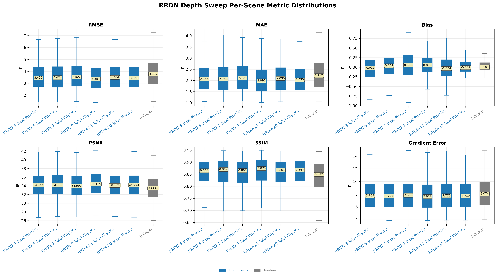

# Satellite Brightness Temperature Super-Resolution

TensorFlow models and reproducible workflows for reconstructing four-times higher-resolution 89 GHz satellite microwave brightness-temperature fields from low-resolution observations.

The project provides two selected RRDN generators:

| Model | Generator | Training objective | Status |
| --- | --- | --- | --- |
| RRDN Composite SSIM | 9 RRDB, 3 RDB/RRDB, 5 conv/RDB, 64 filters | Composite SSIM, alpha 0.8 | Config and checkpoint validated |
| RRDN-GAN | Same RRDN generator | Composite reconstruction plus adversarial refinement | Config and checkpoint validated |

The GAN discriminator uses Batch Normalization during training. BatchNorm is not part of the released generator and is not needed for inference.

## Model architecture

### RRDN generator


The generator maps a single-channel low-resolution BT field of shape `H x W x 1` to a field of shape `4H x 4W x 1`. A shallow convolution first maps BT values into a feature representation. The deep trunk then applies residual-in-residual dense blocks (RRDBs), each composed of densely connected residual dense blocks (RDBs).

Residual learning occurs at three levels: inside each RDB, across each RRDB, and across the complete feature trunk. The RRDB residual is scaled by 0.2 before it is added to the identity path, which stabilizes deeper training. The final head uses bilinear 4x upsampling followed by convolutional refinement. Batch Normalization is omitted from the generator to avoid unnecessarily transforming the radiometric feature distribution.

### RRDN-GAN refinement


GAN training begins from the pretrained 9-RRDB Composite SSIM generator rather than an untrained network. The generator continues to optimize a reconstruction objective while receiving adversarial feedback from a deep PatchGAN-style discriminator. Instead of assigning one real/fake score to an entire scene, the discriminator produces a spatial probability map and evaluates local BT patches around features such as cloud edges, storm boundaries, and sharp thermal transitions.

The released GAN generator was trained with the BatchNorm discriminator variant. The discriminator is required only during adversarial training; prediction uses the generator by itself.

## Repository layout

```text
configs/             Release model architecture and training metadata
docs/                Dataset documentation and selected research figures
legacy/              Historical model-definition references
metadata/            Required normalization statistics
sample_data/         One compact, full-size LR/HR example
scripts/evaluation/  Metrics and visualization workflows
scripts/inference/   HDF5 prediction workflow
scripts/training/    RRDN training and RRDN-GAN fine-tuning
src/                  Canonical importable Python package
tests/                Fast tests and optional release-checkpoint tests
tools/                HDF5, checkpoint, and sample-generation utilities
```

Raw datasets, generated outputs, scheduler logs, and checkpoint binaries are intentionally excluded from Git history.

The original Chen architecture implementations are preserved as `src/bt_super_resolution/models/rdn_chen.py` and `rrdn_chen.py`. Training calls the original `build_RRDN` function directly. The public `build_rrdn` API is only a config-name adapter around that same implementation, ensuring training and inference reconstruct an identical layer topology.

## Installation

Using Conda:

```bash
conda env create -f environment.yml
conda activate bt-super-resolution
```

Using an existing Python 3.10 environment:

```bash
python -m pip install -e .
```

For development and tests:

```bash
python -m pip install -e ".[dev]"
python -m pytest -m "not release"
```

## Model files

Each selected generator is distributed in two formats through GitHub Releases. Training was performed on an HPC environment that did not support saving the newer `.keras` format, so the original selected checkpoints were saved as weights-only `.weights.h5` files. Those validated checkpoints are preserved for architecture reconstruction, fine-tuning, and HPC compatibility. Equivalent `.keras` files are exported afterward for easier loading and prediction.

The expected filenames and SHA-256 checksums are recorded in `configs/` and `release_assets/SHA256SUMS.txt`.

Place downloaded files under `release_assets/`:

```text
release_assets/bt-sr-rrdn-9rrdb-composite-ssim-a08-v0.1.0.weights.h5
release_assets/bt-sr-rrdn-9rrdb-composite-ssim-a08-v0.1.0.keras
release_assets/bt-sr-rrdn-gan-9rrdb-bn-generator-v0.1.0.weights.h5
release_assets/bt-sr-rrdn-gan-9rrdb-bn-generator-v0.1.0.keras
```

<!-- TODO: Replace with links to the first versioned GitHub Release. -->

### What the `.keras` files contain

Both converted artifacts were inspected as Keras v3 archives and reloaded without custom objects. Each contains:

- The complete Functional generator architecture: 484 serialized standard Keras layers.
- All generator weights in the archive's internal `model.weights.h5`.
- Input/output graph configuration, layer names, shapes, and activations.
- Keras serialization metadata, including the Keras version and save date.

The exports have an empty compile configuration because they are inference-focused generator releases. Compared with a compiled training-oriented `.keras` checkpoint, they do not contain an optimizer or optimizer state, training loss, compiled metrics, or custom training objectives. They also do not contain the external Kelvin normalization statistics, YAML experiment metadata, GAN discriminator, dataset, training history, model card, or evaluation outputs. Those companion artifacts remain in the repository. A `.keras` file does not automatically package external preprocessing unless that preprocessing is built into the model graph.

## Python inference

```python
from bt_super_resolution import load_generator

bundle = load_generator("configs/rrdn_composite_ssim_alpha_0.8.yaml")
prediction_kelvin = bundle.predict_kelvin(lr_bt, batch_size=8)
```

The loader reconstructs the exact architecture, verifies the checkpoint checksum, loads the required normalization statistics, and returns predictions in Kelvin.

For Kelvin-aware inference from a complete Keras artifact, use the repository loader:

```python
from bt_super_resolution import load_keras_generator

bundle = load_keras_generator("configs/rrdn_composite_ssim_alpha_0.8.yaml")
prediction_kelvin = bundle.predict_kelvin(lr_bt, batch_size=8)
```

For direct normalized-input Keras loading:

```python
import tensorflow as tf

model = tf.keras.models.load_model(
    "release_assets/bt-sr-rrdn-9rrdb-composite-ssim-a08-v0.1.0.keras",
    compile=False,
)
```

The full model expects normalized LR input and returns normalized HR output. Use the repository loader when Kelvin-aware normalization and denormalization are required.

## HDF5 prediction

Run both selected models on the public example:

```bash
python scripts/inference/make_prediction.py \
    --input sample_data/amsr2_example.h5 \
    --output outputs/example_with_predictions.h5 \
    --batch-size 1 \
    --overwrite \
    --strict
```

The same command accepts a directory and recursively processes every `.h5` or `.hdf5` file.

Use the complete `.keras` models instead of reconstructed weights:

```bash
python scripts/inference/make_prediction.py \
    --input sample_data/amsr2_example.h5 \
    --output outputs/example_keras_predictions.h5 \
    --artifact-format keras \
    --batch-size 1 \
    --overwrite \
    --strict
```

## Evaluation and plots

```bash
python scripts/evaluation/metrics.py \
    --data sample_data/amsr2_example.h5 \
    --output outputs/example_metrics.csv \
    --plot-output outputs/example_metrics_matrix.png \
    --strict

python scripts/evaluation/plot_predictions.py \
    --input outputs/example_with_predictions.h5 \
    --output-dir outputs/prediction_plots \
    --overwrite \
    --strict
```

Generate prediction and residual panels directly from the `.keras` models:

```bash
python scripts/evaluation/plot_selected_model_residuals.py \
    --input sample_data/amsr2_example.h5 \
    --artifact-format keras \
    --output-dir outputs/keras_residual_plots \
    --strict
```

Evaluate the complete `.keras` release artifacts with the same normalization and metrics:

```bash
python scripts/evaluation/metrics.py \
    --data sample_data/amsr2_example.h5 \
    --artifact-format keras \
    --output outputs/example_keras_metrics.csv \
    --strict
```

Metrics include RMSE, global PSNR, mean per-scene SSIM, bias, and inference latency. Plotting preserves the complete spatial field; percentile and residual limits affect only color display.

## Results and visual evaluation

The following figures summarize the current research experiments. They are included as supporting analysis rather than as a claim that fine-scale atmospheric structure can be uniquely recovered from one microwave channel.

### Per-scene model comparison



Across the hurricane-specific evaluation scenes, the 9-RRDB Composite SSIM model improves on the MAE-trained RRDN baseline, while both RRDN-GAN variants show the strongest median RMSE, MAE, PSNR, SSIM, and gradient-error results in this comparison. The discriminator BatchNorm ablation produces only a modest difference: the BatchNorm variant is slightly stronger on several reconstruction metrics, while the no-BatchNorm variant has median bias closer to zero.



The broader sweep tests whether additional depth or physics-inspired gradient terms improve reconstruction. Performance improves only up to a point; increasing RRDB depth alone does not consistently close the gap. One interpretation is that a single-channel BT field contains limited information about viewing geometry, atmospheric state, season, surface conditions, and other factors that influence fine-scale structure. Under these constraints, local structural supervision is more effective in these experiments than simply adding model capacity.

### Reconstruction and residuals


This paired hurricane example compares the original LR input, bilinear interpolation, the RRDN-GAN reconstruction, and the aligned HR target. The enlarged region shows where the learned model restores sharper eyewall and rainband organization than interpolation alone.


Residual maps show `truth - prediction` in Kelvin and make spatially organized errors visible. In this scene, adversarial refinement reduces the displayed error spread relative to the Composite SSIM model while preserving sharper storm structure. A strong visual result should still be read together with RMSE, bias, PSNR, and SSIM because sharper output is not automatically more physically correct.

### Spatial-frequency behavior


Radially averaged power spectral density (PSD) measures how spatial variability is distributed across frequency scales. Lower frequency indices correspond to broad thermal patterns; higher indices correspond to finer changes such as cloud edges and storm boundaries. The GAN curves remain closer to the ground-truth spectrum through more of the middle- and high-frequency range than the reconstruction-only models, supporting the interpretation that patch-based adversarial refinement preserves additional local structure.

All models still under-represent the highest-frequency power. This remaining spectral gap is an important limitation: the LR input does not uniquely encode every missing HR feature, and neither Composite SSIM nor the current physics-inspired loss fully resolves that information bottleneck.

### Operational storm examples

<p align="center">
  
  
</p>

These ATMS examples test inference on meteorologically important scenes outside the paired AMSR2 evaluation set. The Super Typhoon Sinlaku comparison shows the original ATMS field and its RRDN-GAN output; the developing-cyclone example adds VIIRS imagery as contextual reference. Because these cases do not have aligned HR BT targets, they support qualitative inspection only and are not used to claim quantitative reconstruction accuracy.

## Training from scratch

Training data must contain batched `L/bt` and `H/bt` datasets. Server-specific paths are deliberately not embedded in the scripts.

```bash
python scripts/training/train_rrdn.py \
    --train_path /path/to/training_data.h5 \
    --eval_path /path/to/evaluation_data.h5 \
    --stats_path metadata/unified_global_stats.npz \
    --loss_fn composite_ssim \
    --ssim_alpha 0.8
```

If `--eval_path` is omitted, 20 percent of the training data is reserved for validation.

## Continue training with GAN refinement

```bash
python scripts/training/train_gan.py \
    --train_path /path/to/training_data.h5 \
    --stats_path metadata/unified_global_stats.npz \
    --pretrained_generator_path /path/to/pretrained.weights.h5 \
    --use_batchnorm_d
```

Users may train from scratch, fine-tune the released generators, or continue training on their own compatible data. New datasets require carefully validated normalization statistics and sensor-specific evaluation.

## Data

The included `sample_data/amsr2_example.h5` is a 388 KB software-validation example with the production shapes:

```text
L/bt    (96, 100), float32, Kelvin
H/bt    (384, 400), float32, Kelvin
```

It is not a training dataset. The complete local `AMSR2/` collection remains outside Git and should eventually be hosted in a DOI-backed scientific repository. See [docs/DATA.md](docs/DATA.md) for construction, provenance, limitations, and attribution.

## Limitations

- Fine-scale information is not uniquely determined by one low-resolution microwave channel.
- Output behavior may vary with sensor geometry, season, surface type, storm structure, and training coverage.
- Sharper structures do not guarantee physical correctness.
- The HR training targets are physically based simulations, not direct observations from an existing high-resolution sounder.
- Operational ATMS and Tomorrow.io examples without aligned HR targets support qualitative assessment only.

## License

Source code and official released generator weights are licensed under Apache-2.0. This permits model use, modification, fine-tuning, continued training, and redistribution subject to the license and notices. See `LICENSE`, `NOTICE`, and `MODEL_LICENSE.md`.

Third-party and full research datasets retain their respective terms and are not relicensed by this repository.

## Citation

Formal manuscript and dataset citations will be added when public identifiers are assigned. The provisional software metadata is available in `CITATION.cff`.
